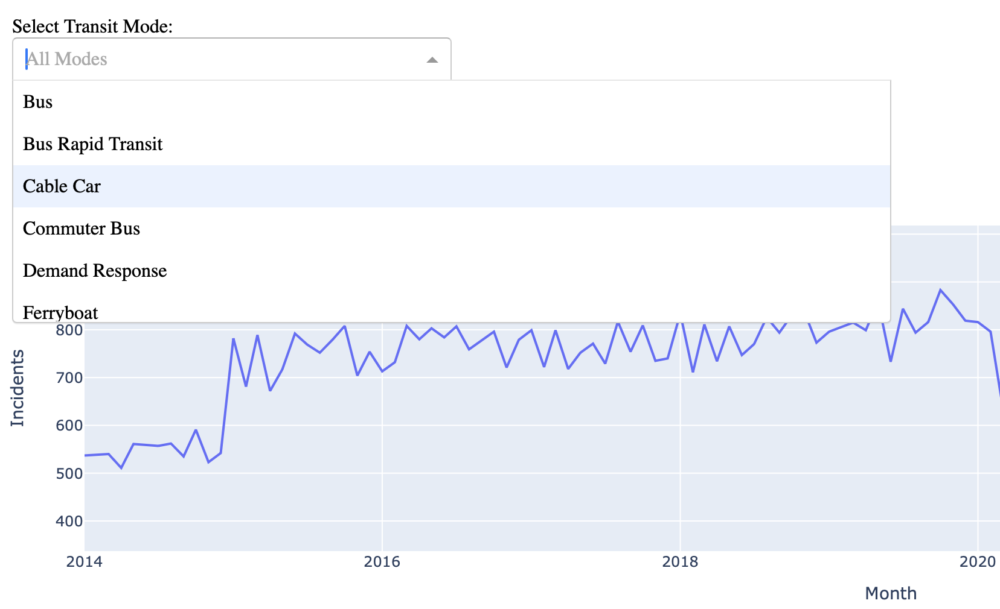
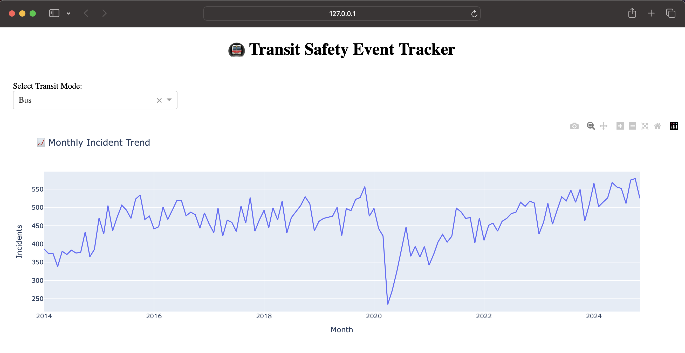
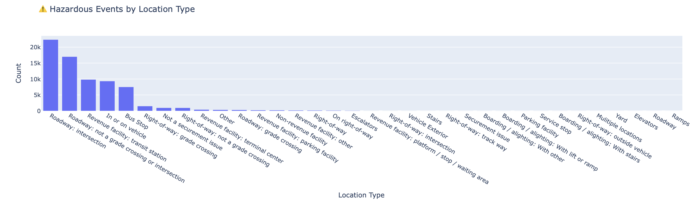

# Transit Infrastructure and Safety Event Tracker

A full-featured Python project for analyzing and visualizing major safety events across transit systems. It processes real-world safety data, flags hazardous incidents, stores results in a queryable SQL database, and displays interactive dashboards for exploration.

---

## Features

✅ Clean and process transit safety datasets  
✅ Automatically flag hazardous events (injury, fatality, or serious injury)  
✅ Load cleaned data into a SQLite database  
✅ Run SQL-based analytics and reports  
✅ View live dashboards with filters and interactive charts  
✅ Simple structure with Pandas, SQLite, Plotly, and Dash

---

## Project Structure
```
transit-safety-analytics/
│── data                            # This where the data goes
│   ├── cleaned_data.csv
│   │── processed_data.csv
│── app.py                          # Dash Dashboard
│── create_sql_db.py                # Creating SQLite DB 
│── process_data.py                 # Clean & flag data
│── query_reports.py                # SQL analytics
│── requirements.txt                # Python dependencies
│── README.md                       # Project documentation
```

## Installation

1. Clone the repository:
   ```bash
   gh repo clone Sarthak2403/Transit_Infrastructure_Safety_Event_Tracker
   cd Transit_Infrastructure_Safety_Event_Tracker

2. Create a virtual environment:
   ```bash
   python -m venv venv
   source venv/bin/activate  # On Windows use `venv\Scripts\activate`
   ```
3. Install dependencies:
   ```bash
   pip install -r requirements.txt
   ```

4. Download the data from:
```
https://data.transportation.gov/api/views/9ivb-8ae9/rows.csv?accessType=DOWNLOAD
```

## Usage
1. Running the App
To launch the dashboard, run:
```bash
python app.py
```

2. Access the dashboard in your browser at http://localhost:8050

3. Use the filters at the top to explore different transit modes.

## Outputs

- SQl Output:
```
🔍 Running SQL Queries on 'safety_events'...

📌 Total Incidents by Mode:
                      Mode Name  total_incidents
0                           Bus            60652
1                    Heavy Rail            12275
2                    Light Rail             9826
3               Demand Response             9403
4               Street Car Rail             2640
5             Bus Rapid Transit             1167
6                  Commuter Bus             1023
7                       Vanpool              520
8                    Trolleybus              434
9   Monorail/Automated Guideway              220
10                  Hybrid Rail              186
11                    Cable Car              126
12                    Ferryboat               74
13                      Publico               60
14               Inclined Plane                5 

⚠️ Hazardous Incidents by Location Type:
                                   Location Type  hazardous_count
0                          Roadway: intersection            22363
1  Roadway: not a grade crossing or intersection            17016
2              Revenue facility: transit station             9853
3                               In or on vehicle             9358
4                                       Bus Stop             7518
5                   Right-of-way: grade crossing             1509
6                         Not a securement issue              978
7             Right-of-way: not a grade crossing              971
8              Revenue facility: terminal center              426
9                                          Other              359 

📅 Monthly Incidents Over Time:
       month  count
0    2014-01    537
1    2014-02    538
2    2014-03    540
3    2014-04    511
4    2014-05    561
..       ...    ...
126  2024-07    913
127  2024-08    894
128  2024-09    923
129  2024-10    952
130  2024-11    846

[131 rows x 2 columns] 

🚗 Incidents Involving Multiple Transit Vehicles:
   multi_transit_incidents
0                      918 

✅ Queries complete.
```

- Dashboard App:





